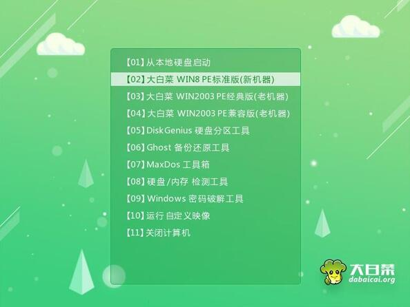
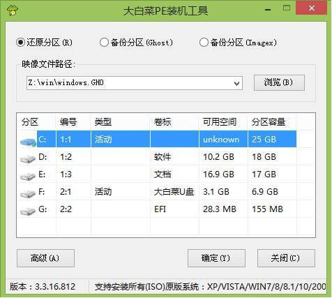

---

---

# 安装系统

### 条件：

大白菜启动盘、win10系统镜像、电脑

### 步骤：

- 电脑关机，插上带有win10系统镜像的大白菜启动盘

- 打开电脑，再电脑启动的时候不停的按F8（华硕主机），进入BIOS系统，设置U盘为启动盘

  

- 等待启动，启动完成之后选择 大白菜win8PE启动，进入系统之后，不要用默认弹出窗口还原分区安装系统，会安装很多额外软件

  

- 进入快速分区KisGenius软件，格式化系统盘（如果系统盘格式是MRB，需要对系统盘进行分区设置，并且格式化系统所在硬盘的其他分区）

  

  - 选中硬盘进行快速分区，分区表类型GUID，对齐分区到此扇区数的整数倍，选择最大值，分区数目自行设置，确认

    

- 接下来打开WinNTSetup 

  

- 数字1选择U盘内下载好的系统；数字2选择系统分区盘中的ESP对应的字母；数字3选择系统分区盘中的系统对应的字母；选项版本建议选专业版；最后点击开始安装。

  

- 完成之后，点击重启，拔掉U盘。

- 安装驱动，激活。。。

### 系统下载

[MSDN](https://msdn.itellyou.cn)，建议下载 business editions 系列

